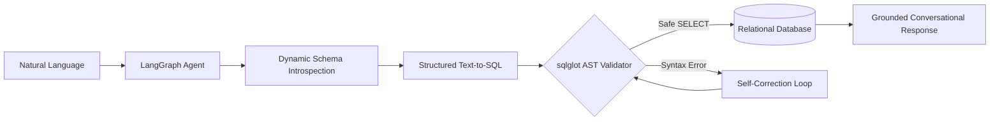

# AI Inventory SQL Assistant

An end-to-end conversational analytics system that converts natural-language inventory questions into validated SQL, executes them against relational business data, self-corrects query errors, and returns grounded answers.

[](https://github.com/Abdelazimm/inventory-sql-ai-chatbot/actions)
[](https://www.python.org/)
[](https://fastapi.tiangolo.com)
[](https://github.com/langchain-ai/langgraph)
[](https://reactjs.org/)

---

## 🎯 Overview & Problem Statement
Enterprise resource planning (ERP) and warehouse management systems store critical asset and procurement data in complex relational schemas with multiple primary/foreign key relationships. Extracting insights often requires non-technical operators to submit tickets to database administrators.

The **AI Inventory SQL Assistant** solves this by providing an autonomous, self-correcting Text-to-SQL agent powered by **LangGraph**, **FastAPI**, **SQLAlchemy**, and **React**.



---

## 🚀 Key Features

* **Dynamic Schema Introspection**: Introspects tables, columns, data types, primary keys, and foreign keys at runtime via SQLAlchemy Inspector.
* **Abstract Syntax Tree (AST) Security Validator**: Programmatically parses SQL with `sqlglot`, allowing only read-only `SELECT`/`WITH` queries and strictly blocking `DROP`, `DELETE`, `UPDATE`, `INSERT`, `ATTACH`, and stacked queries.
* **Self-Correction Engine**: Automatically diagnoses SQL errors and executes up to 3 iterative self-correction cycles before graceful fallback.
* **Persistent Conversational Memory**: UUID-based session checkpointing with LangGraph SQLite saver, supporting pronoun and context resolution.
* **Enterprise RBAC & Authentication**: JWT authentication with 3-tier Role-Based Access Control (`viewer`, `manager`, `admin`).
* **Transactional CSV Ingestion Pipeline**: Ingest and preview bulk CSV records (`Assets`, `Vendors`, `Items`, `Sites`) with atomic rollback.
* **Safe Parameterized Mutations**: Record creation/update/deletion mediated through 2-step verification previews and application-controlled SQL.
* **Modern Web Interface**: React 18 + Vite + TypeScript frontend with dark mode aesthetics, interactive SQL telemetry debug panel, session management, and upload modals.
* **PostgreSQL & SQLite Dual-Support**: Seamless transition from zero-setup SQLite local storage to production-grade PostgreSQL.

---

## 📊 Relational Database Schema

The database model supports standard enterprise procurement and asset tracking entities:

```
Customers (CustomerId, CustomerCode, CustomerName, Email, Phone, BillingAddress)
Vendors (VendorId, VendorCode, VendorName, Email, Phone, City, Country)
Sites (SiteId, SiteCode, SiteName, City, Country, TimeZone)
Locations (LocationId, SiteId, LocationCode, LocationName, ParentLocationId)
Items (ItemId, ItemCode, ItemName, Category, UnitOfMeasure)
Assets (AssetId, AssetTag, AssetName, SiteId, LocationId, VendorId, Cost, Status, SerialNumber)
Bills (BillId, VendorId, BillNumber, BillDate, DueDate, TotalAmount, Status)
PurchaseOrders (POId, PONumber, VendorId, PODate, Status, SiteId)
PurchaseOrderLines (POLineId, POId, LineNumber, ItemId, ItemCode, Quantity, UnitPrice)
SalesOrders (SOId, SONumber, CustomerId, SODate, Status, SiteId)
SalesOrderLines (SOLineId, SOId, LineNumber, ItemId, ItemCode, Quantity, UnitPrice)
AssetTransactions (AssetTxnId, AssetId, FromLocationId, ToLocationId, TxnType, Quantity, TxnDate)
```

---

## 💬 Example Questions

* *"What is the most expensive asset in our inventory?"*
* *"Which vendor supplied the most expensive asset?"*
* *"How many assets are currently in repair?"*
* *"What is the total value of assets located at Headquarters?"*
* *"Which location contains the most assets?"*
* *"Show all open purchase orders placed with Acme Corp."*
* *(Follow-up)*: *"What items are in that purchase order?"*

---

## 🛠️ Quick Start

### 1. Prerequisites
- Python 3.10+
- Node.js 18+ (for frontend)
- OpenAI API Key

### 2. Backend Setup
```bash
# Clone and enter directory
cd inventory-sql-ai-chatbot

# Create and activate virtual environment
python -m venv venv
# Windows:
venv\Scripts\activate
# Linux/macOS:
source venv/bin/activate

# Install dependencies
pip install -r requirements.txt

# Configure environment
cp .env.example .env

# Initialize and seed database
python scripts/setup_database.py

# Start FastAPI server
uvicorn app.main:app --host 127.0.0.1 --port 8000 --reload
```

### 3. Frontend Setup
```bash
cd frontend
npm install
npm run dev
```
Open [http://localhost:5173](http://localhost:5173) in your browser.

Default Test Accounts:
- **Admin**: `admin` / `admin123`
- **Manager**: `manager` / `manager123`
- **Viewer**: `viewer` / `viewer123`

---

## 🐳 Docker Deployment

To launch the entire stack (PostgreSQL + FastAPI + React UI) using Docker Compose:

```bash
docker compose up --build
```
Access the application at [http://localhost:3000](http://localhost:3000).

---

## 🧪 Testing & Evaluation

### Run Test Suite
```bash
pytest -v
```

### Run AI Evaluation Benchmark (35 Questions)
```bash
python -m eval.run_evaluation
```

Sample Benchmark Output:
```text
==================================================
  INVENTORY SQL AI EVALUATION REPORT
==================================================
Total Evaluations:      35
Intent Accuracy:        100.0%
SQL Validity Rate:      100.0%
Security Defense Rate:  100.0%
Average Latency:        12.4 ms
Average Retries:        0.0
==================================================
```

---

## 🔒 Security & Safe Execution
* Read-only connection execution for generated analytics.
* `sqlglot` AST validation preventing SQL injection and stacked queries.
* Two-step explicit confirmation tokens for record mutations.
* See [docs/security.md](docs/security.md) for full threat model.

---

## 📄 License
MIT License.
