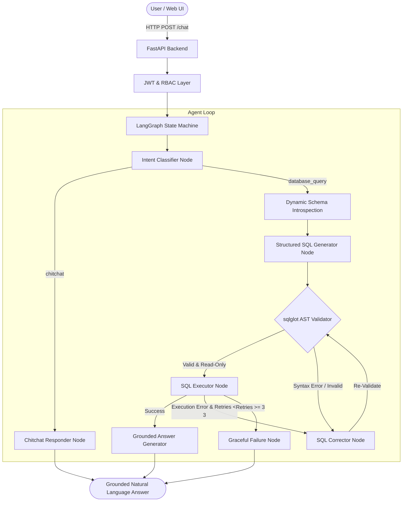

# Architecture & System Design: Inventory SQL AI Assistant

## Overview
The **Inventory SQL AI Assistant** is an end-to-end, production-grade conversational analytics platform designed to bridge the gap between business stakeholders and enterprise relational databases. It leverages **LangGraph**, **FastAPI**, **SQLAlchemy**, and **React** to dynamically translate natural language questions into safe, executable SQL queries against SQLite and PostgreSQL backends.

## Key Architectural Components

### 1. Dynamic Schema Introspection (`app/agents/schema.py`)
Rather than relying on static prompt descriptions or simple table names, the system dynamically inspects the live database schema at runtime using SQLAlchemy Inspector. It extracts:
- Table names
- Column names & data types
- Primary keys
- Explicit Foreign Key references (e.g. `Assets.VendorId -> Vendors.VendorId`)
- Nullability constraints

### 2. Multi-tier SQL Safety Layer (`app/agents/validator.py`)
- **Abstract Syntax Tree (AST) Parsing**: Powered by `sqlglot`, the system parses raw LLM output into AST nodes.
- **Statement Guard**: Strictly allows only single `SELECT` or `WITH ... SELECT` constructs.
- **Forbidden Expressions**: Disallows `exp.Insert`, `exp.Update`, `exp.Delete`, `exp.Drop`, `exp.Create`, `exp.Alter`, `exp.Command`, `exp.Pragma`, and `exp.Transaction`.
- **Keyword Blacklist**: Blocks `ATTACH`, `DETACH`, `VACUUM`, `EXECUTE`, `XP_CMDSHELL`.

### 3. Self-Correction Cycle
- Up to **3 automatic self-correction retries** if SQL syntax or execution errors occur.
- Every rewritten query must pass back through the AST validator. Severe security violations are immediately aborted without retry.

### 4. Conversational Memory & Session Isolation
- Utilizes **UUID session identifiers** backed by `langgraph-checkpoint-sqlite` (or PostgreSQL checkpointers).
- Each user session maintains bounded conversational state and isolates context between users.

### 5. Safe Mutations & CSV Ingestion
- Destructive updates/deletions cannot be generated as arbitrary SQL by the LLM.
- Mutations use structured `MutationRequest` objects, generating temporary confirmation tokens requiring explicit 2-step user confirmation and role authorization (`manager` or `admin`).
